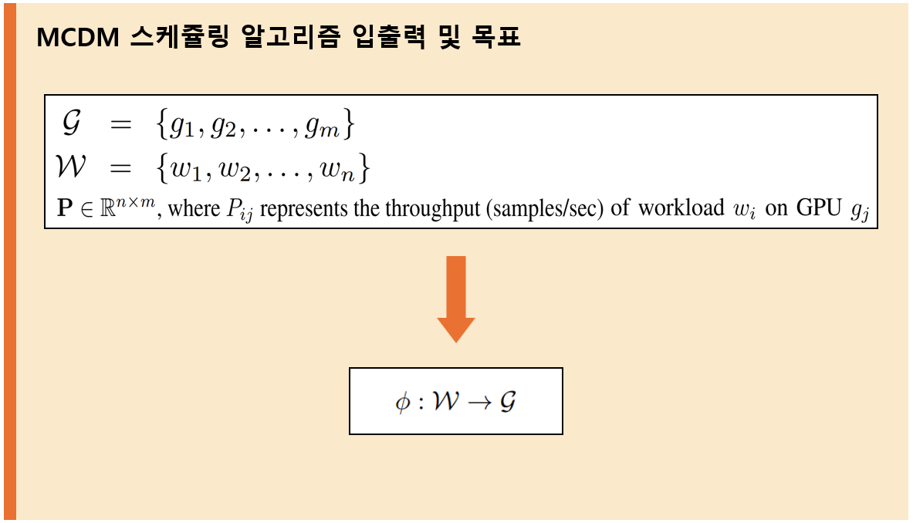
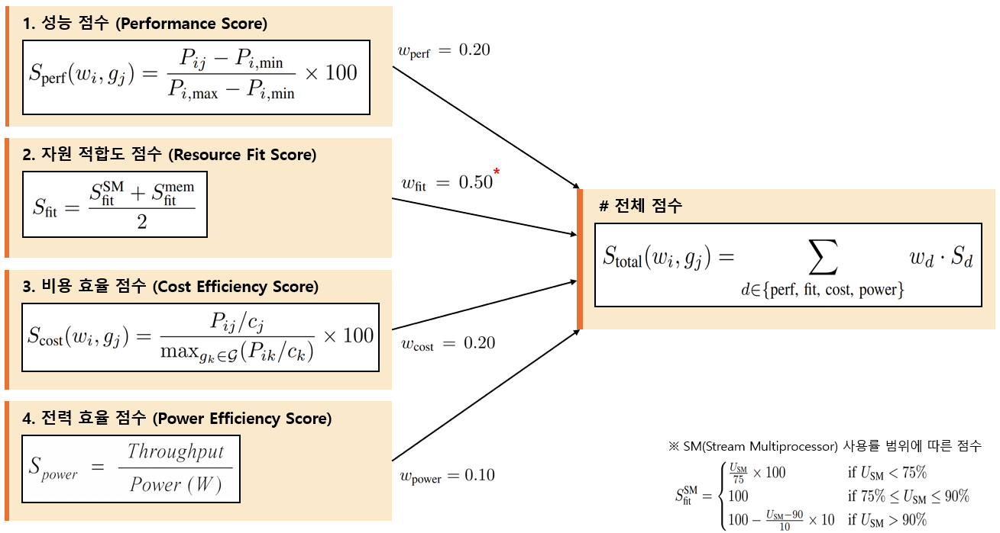
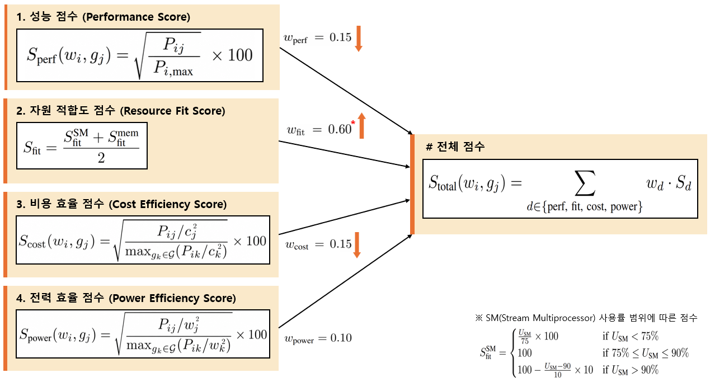

# MCDM GPU 스케줄링 알고리즘

**Multi-Criteria Decision Making (MCDM)** 기반의 이기종 GPU 클러스터 스케줄링 알고리즘입니다.  
단순히 가장 빠른 GPU를 고르는 것이 아니라, **4가지 기준**에 가중치를 달리하여 동시에 평가한 후 최적의 GPU를 결정합니다.

---

## 📐 알고리즘 입출력 및 목표



| 입력 | 설명 |
|------|------|
| **G** = {g₁, g₂, ..., gₘ} | 이기종 GPU 클러스터 (서로 다른 아키텍처/시장세그먼트) |
| **W** = {w₁, w₂, ..., wₙ} | 작업 대기열 리스트 |
| **P ∈ ℝⁿˣᵐ** | 처리량 행렬 — Pᵢⱼ는 GPU gⱼ에서 작업 wᵢ 실행 시 처리량 (samples/sec) |

**목표:** 자원 활용을 최적화하면서 비용을 최소화하는 할당 함수 **φ : W → G** 를 찾는다.

---

## 📊 입력 행렬

알고리즘은 5가지 행렬을 입력으로 사용합니다.

| 행렬 | 설명 | 단위 |
|------|------|------|
| **P** (PerformanceMatrix) | GPU별 작업 처리량 | samples/sec |
| **U_SM** (SMUtilizationMatrix) | GPU별 SM 사용률 | % |
| **U_mem** (MemUtilizationMatrix) | GPU별 메모리 사용률 | % |
| **L** (LatencyMatrix) | GPU별 작업 처리 시간 | sec |

> LatencyMatrix는 `L_ij = Total_Samples_i / P_ij` 로 계산됩니다.

---

## 🔢 점수 계산 방식 (기존과 다르게 변경)




### 1. 성능 점수 (Performance Score, S_perf)

원래 논문의 min-max 정규화 방식은 GPU 수가 적을 때 격차가 과도하게 확대되는 문제가 있어, 최고 성능 GPU 대비 비선형 정규화 방식으로 변경하였습니다.

$$S_{\text{perf}}(w_i, g_j) = \sqrt{\frac{P_{ij}}{P_{i,\max}}} \times 100$$

- 최고 성능 GPU는 항상 100점
- 루트를 사용하여 하위 GPU의 점수 격차를 완화

### 2. 자원 적합도 점수 (Resource Fit Score, S_fit)

SM 사용률과 메모리 사용률이 **최적 범위**에 얼마나 잘 맞는지 평가합니다.  
과잉 프로비저닝과 과소 프로비저닝 모두 패널티로 반영됩니다.

$$S_{\text{fit}} = \frac{S_{\text{fit}}^{\text{SM}} + S_{\text{fit}}^{\text{mem}}}{2}$$

**SM 사용률 구간별 점수:**

| 구간 | 점수 |
|------|------|
| U_SM < 75% | (U_SM / 75) × 100 |
| 75% ≤ U_SM ≤ 90% | 100 (최적) |
| U_SM > 90% | 100 − ((U_SM − 90) / 10) × 10 |

**메모리 사용률 구간별 점수:**

| 구간 | 점수 |
|------|------|
| U_mem < 55% | (U_mem / 55) × 100 |
| 55% ≤ U_mem ≤ 75% | 100 (최적) |
| U_mem > 75% | max(0, 100 − ((U_mem − 75) / 25) × 50) |

### 3. 비용 효율 점수 (Cost Efficiency Score, S_cost)

비용이 높은 GPU에 강한 패널티를 주기 위해 비용을 제곱하여 분모에 적용하고, 루트로 정규화합니다.

$$S_{\text{cost}}(w_i, g_j) = \sqrt{\frac{P_{ij}/c_j^2}{\max_{g_k \in \mathcal{G}}(P_{ik}/c_k^2)}} \times 100$$

- $c_j$: GPU $g_j$의 시간당 비용 (달러)
- 비용 제곱으로 고비용 GPU 페널티 강화

### 4. 전력 효율 점수 (Power Efficiency Score, S_power)

전력 소비가 높은 GPU에 강한 패널티를 주기 위해 Watt를 제곱하여 분모에 적용하고, 루트로 정규화합니다.

$$S_{\text{power}}(w_i, g_j) = \sqrt{\frac{P_{ij}/\text{Watt}_j^2}{\max_{g_k \in \mathcal{G}}(P_{ik}/\text{Watt}_k^2)}} \times 100$$

- $\text{Watt}_j$: GPU $g_j$의 최대 전력 소비 (W)
- Watt 제곱으로 고전력 GPU 페널티 강화

---

## ⚖️ 가중치 및 최종 점수

$$S_{\text{total}}(w_i, g_j) = \sum_{d \in \{\text{perf, fit, cost, power}\}} w_d \cdot S_d$$

| 기준 | 가중치 | 의미 |
|------|--------|------|
| w_perf | **0.15** | 성능 |
| **w_fit** | **0.60** | 자원 매칭 (가장 중요) |
| w_cost | **0.15** | 비용 효율 |
| w_power | **0.10** | 전력 효율 |

> 자원 매칭(w_fit = 0.60)을 가장 중요하게 반영하여, 단순히 빠른 GPU가 아니라 작업 크기에 GPU가 잘 맞는지를 우선적으로 고려합니다.

---

## 🗂️ 파일 구성

```
Algorithm/
├── mcdm_scheduler.py   # MCDM 스케줄링 알고리즘 구현 (Python)
└── README.md           # 알고리즘 설명 문서
```

---

## 🚀 실행 방법

```bash
python mcdm_scheduler.py
```

### 입력 명령어

| 명령어 | 설명 |
|--------|------|
| `w0` ~ `w17` | 특정 작업 단일 스케줄링 |
| `all` | 전체 18개 작업 스케줄링 + GPU 할당 비율 출력 |
| `list` / `ls` | 작업 목록 출력 |
| `q` / `quit` | 종료 |

### 출력 예시
```
════════════════════════════════════════════════════════════════════════
  작업: [w15] bert-base-cased-inf (batch16)
════════════════════════════════════════════════════════════════════════
  GPU                    S_perf    S_fit   S_cost  S_power  S_total
────────────────────────────────────────────────────────────────────────
★ RTX 3090                 91.1     18.2    100.0    100.0     58.3
  RTX 4090                100.0     27.6     57.7     57.7     49.9
  RTX 6000                100.0      9.8     38.5     32.1     38.1
────────────────────────────────────────────────────────────────────────
  ✔  할당 GPU: RTX 3090  (총점: 58.3)  |  처리시간: 10.8858 sec
```

### all 출력 예시
```
  GPU 할당 비율 →  RTX 3090: 56% | RTX 4090: 44%
```

---

## 📝 기존 알고리즘과 차별점

- **환경**: 논문에는 총 5개의 GPU를 사용하였지만 3개의 GPU만을 사용함

- **성능 점수**: 논문의 min-max 방식 대신 `sqrt(P/P_max)` 비선형 정규화 사용 — GPU 수가 적을 때 격차 과대화 방지
- **비용/전력 점수**: 분모에 비용·Watt를 제곱 적용 후 루트 정규화 — 고비용·고전력 GPU 페널티 강화, 제곱근으로 격차 완화
- **메모리 사용률 점수**: 논문에 수식 없어 SM 점수 구조를 메모리 최적 범위(55~75%)에 동일하게 적용
- **가중치 변경**: 벤치마크 결과에서 RTX6000의 처리량이 압도적으로 크서 무조건적으로 선택하는 경우를 줄이기 위해 변경
- **처리시간**: 할당 결과 출력 시 `Total_Samples / throughput` 으로 계산된 실제 처리 시간(sec) 함께 표시